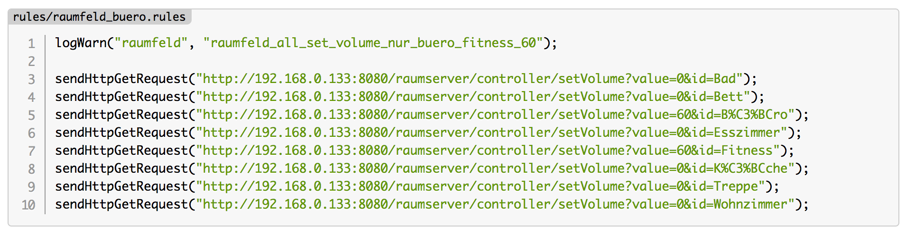
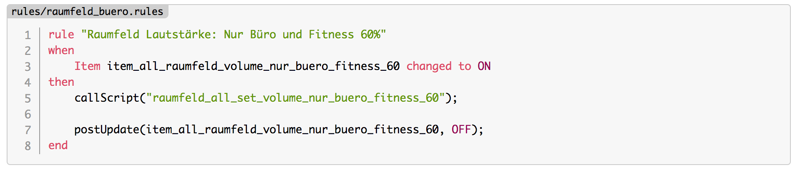
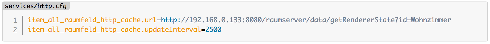
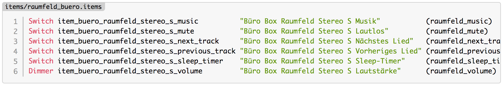
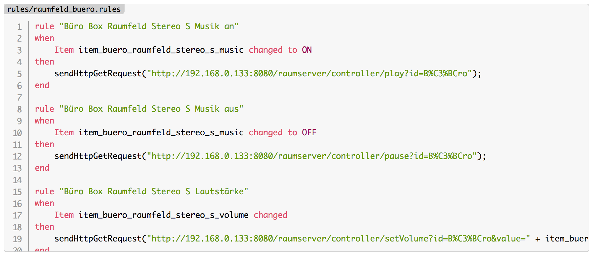
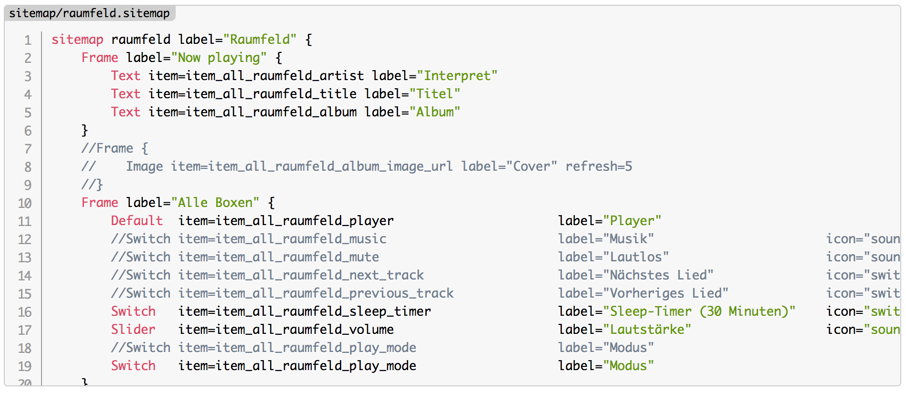

# prism.js openhab

OpenHAB configuration file syntax highlighting for prism (https://github.com/PrismJS/prism).

## Work in progress

This project is work in progress, so some highlighting may missing.

## Installation

Just drop the `language.js` in your project and use the class `language-openhab`. Example:

```
<pre class="line-numbers language-openhab">
    <span class="filename">rules/raumfeld_buero.rules</span>
    <code>
        rule "Raumfeld Lautstärke: Nur Büro und Fitness 60%"
        when
            Item item_all_raumfeld_volume_nur_buero_fitness_60 changed to ON
        then
            callScript("raumfeld_all_set_volume_nur_buero_fitness_60");

            postUpdate(item_all_raumfeld_volume_nur_buero_fitness_60, OFF);
        end
    </code>
</pre>
```

## Screenshots











